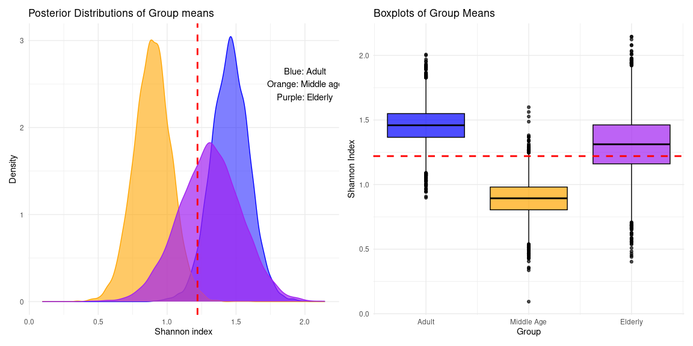

# Probabilistic multi-group comparison of alpha diversity
Rasmus Hindström
2025-08-11

- [0. Summary](#0-summary)
- [1. Data preparation](#1-data-preparation)
- [2. Model fitting](#2-model-fitting)
- [3. Posterior plotting](#3-posterior-plotting)
- [4. Quantify probabilities and effect
  sizes](#4-quantify-probabilities-and-effect-sizes)
- [5. Classical approachs to multi-group
  testing](#5-classical-approachs-to-multi-group-testing)
  - [5.1. ANOVA](#51-anova)
  - [5.2. Kruskal-Wallis](#52-kruskal-wallis)
- [6. Benchmarking speed](#6-benchmarking-speed)
- [7. Conclusions](#7-conclusions)

# 0. Summary

This report demonstrates the use and interpretation of a probabilisitc
alternative to multi-group comparisons of alpha diversity. Group means
are estimated using a linear model fit with the `brms` package.

# 1. Data preparation

Preparing data from the `mia` package.

``` r
library(mia)
library(dplyr)
library(brms)
library(bayesplot)
library(dunn.test)
library(ggplot2)
library(patchwork)
library(rstatix)
library(microbenchmark)
```

``` r
data("peerj13075", package = "mia")
tse <- peerj13075
tse <- addAlpha(
    tse,
    assay.type = "counts",
    index = "shannon"
)
df <- as.data.frame(colData(tse))
```

# 2. Model fitting

The model is fit using the `brm` function from the `brms` package. The
response variable is the Shannon index, and the grouping variable is the
3 classes of `age`; `Adult`, `Middle_age`, and `Elderly`.

The model is parametrized to model the group means directly, with no
intercept. Groups are allowed unequal variance, and means are modeled
from a t distrubtion. The shape parameter $\nu$ is estimated from data.

Model definition is as follows:

$$
y_{ik} \sim \text{t}(\nu, \mu_{ik}, \sigma_k)
$$

$$
\mu_{ik} = \beta_k
$$

$$
\sigma_k = \gamma_k
$$

*Default priors used by `brm()`*

$$
\nu \sim \gamma(2, 0.1)
$$ $$
\beta_0 \sim \text{t}(3, 1.3, 2.5)
$$ $$
\gamma_0 \sim \text{t}(3, 0, 2.5)
$$

$$
\beta_k, \gamma_k \sim \mathrm{Uniform}
$$

``` r
# Model with no partial pooling 
fit <- brm(
    formula = bf(
        shannon ~ 0 + Age,
        sigma ~ 0 + Age
    ),
    data = df,
    family = student(),
    #control = list(adapt_delta = 0.9), # If divergence issues
    algorithm = "sampling",
    iter = 4000 
)
```

     Family: student 
      Links: mu = identity; sigma = log; nu = identity 
    Formula: shannon ~ 0 + Age 
             sigma ~ 0 + Age
       Data: df (Number of observations: 58) 
      Draws: 4 chains, each with iter = 4000; warmup = 2000; thin = 1;
             total post-warmup draws = 8000

    Regression Coefficients:
                        Estimate Est.Error l-95% CI u-95% CI Rhat Bulk_ESS Tail_ESS
    AgeAdult                1.46      0.14     1.19     1.73 1.00    10103     5418
    AgeElderly              1.31      0.23     0.86     1.75 1.00    12062     5647
    AgeMiddle_age           0.89      0.14     0.63     1.16 1.00    11480     6100
    sigma_AgeAdult         -0.45      0.17    -0.78    -0.11 1.00    11057     5783
    sigma_AgeElderly       -0.11      0.18    -0.44     0.28 1.00    11653     5937
    sigma_AgeMiddle_age    -0.71      0.20    -1.07    -0.30 1.00    10605     6413

    Further Distributional Parameters:
       Estimate Est.Error l-95% CI u-95% CI Rhat Bulk_ESS Tail_ESS
    nu    24.29     14.54     5.72    60.85 1.00     9847     6127

    Draws were sampled using sampling(NUTS). For each parameter, Bulk_ESS
    and Tail_ESS are effective sample size measures, and Rhat is the potential
    scale reduction factor on split chains (at convergence, Rhat = 1).

Interpreting the coefficients and 95% CI we can already make the
observation that the groups appear to have rather different means.

Further plotting is required to make conclusions on other pair wise
comparisons.

# 3. Posterior plotting

<details class="code-fold">
<summary>Posterior plotting</summary>

``` r
draws <- as_draws_df(fit)
population <- c(draws$b_AgeAdult, draws$b_AgeMiddle_age, draws$b_AgeElderly)
pop_mean <- mean(population)

plot_data <- data.frame(
    pop_mean = pop_mean,
    adult = draws$b_AgeAdult,
    adult_sd = draws$b_sigma_AgeAdult,
    elderly = draws$b_AgeElderly,
    elderly_sd = draws$b_sigma_AgeElderly,
    middle_age = draws$b_AgeMiddle_age,
    middle_age_sd = draws$b_sigma_AgeMiddle_age
)

p1 <- ggplot(data = plot_data) +
    geom_density(aes(x = adult), fill = "blue", alpha = 0.5, color = "blue") +
    geom_density(aes(x = middle_age), fill = "orange", alpha = 0.6, color = "orange") +
    geom_density(aes(x = elderly), fill = "purple", alpha = 0.7, color = "purple") +
    geom_vline(xintercept = plot_data$pop_mean, linetype = "dashed", color = "red", linewidth = 1) +
    labs(
        title = "Posterior Distributions of Group means",
        x = "Shannon index",
        y = "Density"
    ) +
    annotate(
        "text", x = 2, y = 2.5,
        label = "Blue: Adult\nOrange: Middle age\nPurple: Elderly"
    ) +
    theme_minimal()

p2 <- ggplot(data = plot_data) +
    geom_boxplot(aes(y = adult, x = 1), fill = "blue", alpha = 0.7, color = "black") +
    geom_boxplot(aes(y = middle_age, x = 2), fill = "orange", alpha = 0.7, color = "black") +
    geom_boxplot(aes(y = elderly, x = 3), fill = "purple", alpha = 0.7, color = "black") +
    geom_hline(yintercept = plot_data$pop_mean, linetype = "dashed", color = "red", linewidth = 1) +
    scale_x_continuous(
        breaks = c(1, 2, 3),
        labels = c("Adult", "Middle Age", "Elderly")
    ) +
    labs(
        title = "Boxplots of Group Means",
        x = "Group",
        y = "Shannon Index"
    ) +
    theme_minimal()

p1 + p2
```

</details>



From the plots we can infer groups are not similar. Particularly the
Middle aged (Orange) group appears to have a lower Shannon index. The
boxplots paint a clear picture of the higher overlap between the Adult
and Edlerly group, while the Middle aged group differs. In both plots
the red dashed line indicates the total population posterior mean.

Using the posterior distributions, we can make statements about the
differences between the groups. In this context the probability of
observing a lower Shannon index is appropriate, akin to a classical
p-value.

# 4. Quantify probabilities and effect sizes

<details class="code-fold">
<summary>Probabilities and Standardized Effect Size</summary>

``` r
calc_cohenD_post <- function(mu_1, mu_2, sd_1, sd_2) {
    # Calculates effect size from posterior draws
    diff <- mu_1 - mu_2
    pooled_sd <- sqrt((sd_1^2 + sd_2^2) / 2)
    d <- diff / pooled_sd
    mean_d <- mean(d)
    ci_d <- quantile(d, probs = c(0.05, 0.95))
    res <- list(
        "d" = mean_d,
        "ci" = ci_d
    )
    return(res)
}

calc_logfc_post <- function(mu_1, mu_2) {
    # Calculates log fold change from posterior draws
    logfc <- log2(mu_1 / mu_2)
    mean_logfc <- mean(logfc)
    ci_logfc <- quantile(logfc, probs = c(0.05, 0.95))
    res <- list(
        "logfc" = mean_logfc,
        "ci" = ci_logfc
    )
    return(res)
}

# Calculate effect sizes
logfc_adult_elderly <- calc_logfc_post(plot_data$adult, plot_data$elderly)
logfc_adult_middleage <- calc_logfc_post(plot_data$adult, plot_data$middle_age)
logfc_elderly_middleage <- calc_logfc_post(plot_data$elderly, plot_data$middle_age)

cohenD_adult_elderly <- calc_cohenD_post(
    plot_data$adult, 
    plot_data$elderly, 
    plot_data$adult_sd, 
    plot_data$elderly_sd
)
cohenD_adult_middleage <- calc_cohenD_post(
    plot_data$adult, 
    plot_data$middle_age, 
    plot_data$adult_sd, 
    plot_data$middle_age_sd
)
cohenD_elderly_middleage <- calc_cohenD_post(
    plot_data$elderly, 
    plot_data$middle_age, 
    plot_data$elderly_sd, 
    plot_data$middle_age_sd
)


probabilities <- data.frame(
    Comparison = c(
        "Adult vs Elderly",
        "Adult vs Middle age",
        "Elderly vs Middle age"
    ),
    Prob_lesser = c(
        prob_adult_elderly <- mean(plot_data$adult < plot_data$elderly),
        prob_adult_middleage <- mean(plot_data$adult < plot_data$middle_age),
        prob_elderly_middleage <- mean(plot_data$elderly < plot_data$middle_age)
    ),
    LogFC = c(
        logfc_adult_elderly$logfc,
        logfc_adult_middleage$logfc,
        logfc_elderly_middleage$logfc
    ),
    LogFC_ci_lower = c(
        logfc_adult_elderly$ci[1],
        logfc_adult_middleage$ci[1],
        logfc_elderly_middleage$ci[1]
    ),
    LogFC_ci_upper = c(
        logfc_adult_elderly$ci[2],
        logfc_adult_middleage$ci[2],
        logfc_elderly_middleage$ci[2]
    ),
    cohens_d = c(
        cohenD_adult_elderly$d,
        cohenD_adult_middleage$d,
        cohenD_elderly_middleage$d
    ),
    d_ci_lower = c(
        cohenD_adult_elderly$ci[1],
        cohenD_adult_middleage$ci[1],
        cohenD_elderly_middleage$ci[1]
    ),
    d_ci_upper = c(
        cohenD_adult_elderly$ci[2],
        cohenD_adult_middleage$ci[2],
        cohenD_elderly_middleage$ci[2]
    )
)

knitr::kable(probabilities, caption = "", format = "pipe")
```

</details>

| Comparison | Prob_lesser | LogFC | LogFC_ci_lower | LogFC_ci_upper | cohens_d | d_ci_lower | d_ci_upper |
|:---|---:|---:|---:|---:|---:|---:|---:|
| Adult vs Elderly | 0.288625 | 0.1699242 | -0.2873575 | 0.6776858 | 0.4913407 | -0.9560068 | 2.116523 |
| Adult vs Middle age | 0.002375 | 0.7166079 | 0.3087012 | 1.1672825 | 0.9880746 | 0.4054168 | 1.793339 |
| Elderly vs Middle age | 0.054875 | 0.5466838 | -0.0157151 | 1.0914549 | 0.8666647 | -0.0233644 | 2.003627 |

Notice, that these are not classical p-values, but posterior
probabilities. The probabilities of observing a lower shannon index in
the first group of each comparison are reported. They have been
calculated from the full posterior distribution.

Effect size’s are reported as Log Fold Change (LogFC) and standardized
effect size (Cohen’s d) with 95% CI’s.

Combining the probabilities and effect sizes, we can conclude that the
`Middle age` group has a lower Shannon index compared to the `Adult`
group. With high probability (0.99) of observing a higher Shannon index
in the `Adult` group and a higher then 95% chance of observing an
positive effect size.

The `Elderly` group has a similar pattern, with a high probabilty of
observing a higher Shannon index than the `Middle age` group, but effect
size 95% CI’s overlap zero. This indicates that the difference is not as
pronounced as with the `Adult` group.

Comparing the `Adult` and `Elderly` groups, the probability of observing
a higher Shannon index in the `Adult` group is greater then 50%, but the
effect size is small, with a 95% CI that overlaps zero. This indicates
that the difference is not likely to be meaningful.

# 5. Classical approachs to multi-group testing

## 5.1. ANOVA

ANOVA would be the closest classical alternative. Assumptions in ANOVA
are normality and equal variance.

``` r
res_anova <- aov(shannon ~ Age, data = df)

summary(res_anova)
```

                Df Sum Sq Mean Sq F value Pr(>F)  
    Age          2  3.188  1.5942   3.194 0.0487 *
    Residuals   55 27.448  0.4991                 
    ---
    Signif. codes:  0 '***' 0.001 '**' 0.01 '*' 0.05 '.' 0.1 ' ' 1

Our result inidcates that Age is a significant predictor on explaining
differences in the Shannon index. After observing a significant result,
it is typical to further inspect the data with a pairwise t-test.
Another option is Tukey’s Honest Significant Difference (HSD). Both of
which require adjusting p-values due to being post-hoc tests.

``` r
# Pairwise t-test
pairwise.t.test(df$shannon, df$Age, p.adjust = "fdr")
```


        Pairwise comparisons using t tests with pooled SD 

    data:  df$shannon and df$Age 

               Adult Elderly
    Elderly    0.505 -      
    Middle_age 0.047 0.132  

    P value adjustment method: fdr 

``` r
# HSD
TukeyHSD(aov(shannon ~ Age, data = df))
```

      Tukey multiple comparisons of means
        95% family-wise confidence level

    Fit: aov(formula = shannon ~ Age, data = df)

    $Age
                             diff        lwr         upr     p adj
    Elderly-Adult      -0.1477303 -0.6783059  0.38284533 0.7814198
    Middle_age-Adult   -0.5690925 -1.1182905 -0.01989461 0.0406666
    Middle_age-Elderly -0.4213623 -1.0060281  0.16330359 0.2011258

Both post-hoc tests point to the significant difference between the
groups `Adult` and `Middle age`. In the pairwise t-test the difference
between groups `Middle age` and `Elderly` approaches the significance
boundry (p \< 0.05).

## 5.2. Kruskal-Wallis

Another option to ANOVA is the Kruskal-Wallis test. Kruskal-Wallis
relaxes the assumption of normality. However, It also needs to be paired
with a post-hoc test to infer paired differences after global
significance has been tested. Kruskal-Wallis is typically paired with
Dunn’s post-hoc test.

``` r
kruskal.test(shannon ~ Age, df)
```


        Kruskal-Wallis rank sum test

    data:  shannon by Age
    Kruskal-Wallis chi-squared = 7.7239, df = 2, p-value = 0.02103

We get a p-value \< 0.05, so there are ‘significant’ differences within
the groups.

``` r
dunn.test(df$shannon, df$Age, method = "bh", kw = FALSE)
```


                               Comparison of x by group                            
                                 (Benjamini-Hochberg)                              
    Col Mean-|
    Row Mean |      Adult    Elderly
    ---------+----------------------
     Elderly |   0.672628
             |     0.2506
             |
    Middle_a |   2.733071   1.956873
             |    0.0094*     0.0378

    alpha = 0.05
    Reject Ho if p <= alpha/2

Significant p-values, after adjustment, are reported for the comparison
between groups `Adult` and `Middle age`.

# 6. Benchmarking speed

Using the `microbenchmark` package we can compare the raw speed of the
methods.

<details class="code-fold">
<summary>Comparison of run times</summary>

``` r
.bayes_est <- function(df) {
    fit <- brm(
    formula = bf(
        shannon ~ 0 + Age,
        sigma ~ 0 + Age
    ),
    data = df,
    family = student(),
    #control = list(adapt_delta = 0.9), # Can help with divergence issues
    algorithm = "sampling",
    iter = 4000
    ) 
    return(fit)
}

.anova <- function(df) {
    fit <- aov(shannon ~ Age, data = df)
    res_posthoc <- TukeyHSD(fit)
    return(
        list(
            fit = fit,
            post_hoc = res_posthoc
        )
    )
}

.kruskal_test <- function(df) {
    fit <- kruskal.test(shannon ~ Age, df)
    res_posthoc <- dunn.test(df$shannon, df$Age, method = "bh", kw = FALSE)
    return(
        list(
            fit = fit,
            post_hoc = res_posthoc
        )
    )
}

mb_res <- microbenchmark(
    .bayes_est(df),
    .anova(df),
    .kruskal_test(df),
    times = 1L, # adjust for more repetitions
    unit = "seconds"
)
```

</details>


                               Comparison of x by group                            
                                 (Benjamini-Hochberg)                              
    Col Mean-|
    Row Mean |      Adult    Elderly
    ---------+----------------------
     Elderly |   0.672628
             |     0.2506
             |
    Middle_a |   2.733071   1.956873
             |    0.0094*     0.0378

    alpha = 0.05
    Reject Ho if p <= alpha/2

    Compiling Stan program...

    Start sampling


    SAMPLING FOR MODEL 'anon_model' NOW (CHAIN 1).
    Chain 1: 
    Chain 1: Gradient evaluation took 1.9e-05 seconds
    Chain 1: 1000 transitions using 10 leapfrog steps per transition would take 0.19 seconds.
    Chain 1: Adjust your expectations accordingly!
    Chain 1: 
    Chain 1: 
    Chain 1: Iteration:    1 / 4000 [  0%]  (Warmup)
    Chain 1: Iteration:  400 / 4000 [ 10%]  (Warmup)
    Chain 1: Iteration:  800 / 4000 [ 20%]  (Warmup)
    Chain 1: Iteration: 1200 / 4000 [ 30%]  (Warmup)
    Chain 1: Iteration: 1600 / 4000 [ 40%]  (Warmup)
    Chain 1: Iteration: 2000 / 4000 [ 50%]  (Warmup)
    Chain 1: Iteration: 2001 / 4000 [ 50%]  (Sampling)
    Chain 1: Iteration: 2400 / 4000 [ 60%]  (Sampling)
    Chain 1: Iteration: 2800 / 4000 [ 70%]  (Sampling)
    Chain 1: Iteration: 3200 / 4000 [ 80%]  (Sampling)
    Chain 1: Iteration: 3600 / 4000 [ 90%]  (Sampling)
    Chain 1: Iteration: 4000 / 4000 [100%]  (Sampling)
    Chain 1: 
    Chain 1:  Elapsed Time: 0.109 seconds (Warm-up)
    Chain 1:                0.112 seconds (Sampling)
    Chain 1:                0.221 seconds (Total)
    Chain 1: 

    SAMPLING FOR MODEL 'anon_model' NOW (CHAIN 2).
    Chain 2: 
    Chain 2: Gradient evaluation took 1.3e-05 seconds
    Chain 2: 1000 transitions using 10 leapfrog steps per transition would take 0.13 seconds.
    Chain 2: Adjust your expectations accordingly!
    Chain 2: 
    Chain 2: 
    Chain 2: Iteration:    1 / 4000 [  0%]  (Warmup)
    Chain 2: Iteration:  400 / 4000 [ 10%]  (Warmup)
    Chain 2: Iteration:  800 / 4000 [ 20%]  (Warmup)
    Chain 2: Iteration: 1200 / 4000 [ 30%]  (Warmup)
    Chain 2: Iteration: 1600 / 4000 [ 40%]  (Warmup)
    Chain 2: Iteration: 2000 / 4000 [ 50%]  (Warmup)
    Chain 2: Iteration: 2001 / 4000 [ 50%]  (Sampling)
    Chain 2: Iteration: 2400 / 4000 [ 60%]  (Sampling)
    Chain 2: Iteration: 2800 / 4000 [ 70%]  (Sampling)
    Chain 2: Iteration: 3200 / 4000 [ 80%]  (Sampling)
    Chain 2: Iteration: 3600 / 4000 [ 90%]  (Sampling)
    Chain 2: Iteration: 4000 / 4000 [100%]  (Sampling)
    Chain 2: 
    Chain 2:  Elapsed Time: 0.117 seconds (Warm-up)
    Chain 2:                0.124 seconds (Sampling)
    Chain 2:                0.241 seconds (Total)
    Chain 2: 

    SAMPLING FOR MODEL 'anon_model' NOW (CHAIN 3).
    Chain 3: 
    Chain 3: Gradient evaluation took 1.3e-05 seconds
    Chain 3: 1000 transitions using 10 leapfrog steps per transition would take 0.13 seconds.
    Chain 3: Adjust your expectations accordingly!
    Chain 3: 
    Chain 3: 
    Chain 3: Iteration:    1 / 4000 [  0%]  (Warmup)
    Chain 3: Iteration:  400 / 4000 [ 10%]  (Warmup)
    Chain 3: Iteration:  800 / 4000 [ 20%]  (Warmup)
    Chain 3: Iteration: 1200 / 4000 [ 30%]  (Warmup)
    Chain 3: Iteration: 1600 / 4000 [ 40%]  (Warmup)
    Chain 3: Iteration: 2000 / 4000 [ 50%]  (Warmup)
    Chain 3: Iteration: 2001 / 4000 [ 50%]  (Sampling)
    Chain 3: Iteration: 2400 / 4000 [ 60%]  (Sampling)
    Chain 3: Iteration: 2800 / 4000 [ 70%]  (Sampling)
    Chain 3: Iteration: 3200 / 4000 [ 80%]  (Sampling)
    Chain 3: Iteration: 3600 / 4000 [ 90%]  (Sampling)
    Chain 3: Iteration: 4000 / 4000 [100%]  (Sampling)
    Chain 3: 
    Chain 3:  Elapsed Time: 0.11 seconds (Warm-up)
    Chain 3:                0.124 seconds (Sampling)
    Chain 3:                0.234 seconds (Total)
    Chain 3: 

    SAMPLING FOR MODEL 'anon_model' NOW (CHAIN 4).
    Chain 4: 
    Chain 4: Gradient evaluation took 1.2e-05 seconds
    Chain 4: 1000 transitions using 10 leapfrog steps per transition would take 0.12 seconds.
    Chain 4: Adjust your expectations accordingly!
    Chain 4: 
    Chain 4: 
    Chain 4: Iteration:    1 / 4000 [  0%]  (Warmup)
    Chain 4: Iteration:  400 / 4000 [ 10%]  (Warmup)
    Chain 4: Iteration:  800 / 4000 [ 20%]  (Warmup)
    Chain 4: Iteration: 1200 / 4000 [ 30%]  (Warmup)
    Chain 4: Iteration: 1600 / 4000 [ 40%]  (Warmup)
    Chain 4: Iteration: 2000 / 4000 [ 50%]  (Warmup)
    Chain 4: Iteration: 2001 / 4000 [ 50%]  (Sampling)
    Chain 4: Iteration: 2400 / 4000 [ 60%]  (Sampling)
    Chain 4: Iteration: 2800 / 4000 [ 70%]  (Sampling)
    Chain 4: Iteration: 3200 / 4000 [ 80%]  (Sampling)
    Chain 4: Iteration: 3600 / 4000 [ 90%]  (Sampling)
    Chain 4: Iteration: 4000 / 4000 [100%]  (Sampling)
    Chain 4: 
    Chain 4:  Elapsed Time: 0.117 seconds (Warm-up)
    Chain 4:                0.123 seconds (Sampling)
    Chain 4:                0.24 seconds (Total)
    Chain 4: 

<details class="code-fold">
<summary>Comparison of run times</summary>

``` r
mb_res
```

</details>

    Unit: seconds
                  expr          min           lq         mean       median
        .bayes_est(df) 52.044895446 52.044895446 52.044895446 52.044895446
            .anova(df)  0.003202883  0.003202883  0.003202883  0.003202883
     .kruskal_test(df)  0.001787306  0.001787306  0.001787306  0.001787306
               uq          max neval
     52.044895446 52.044895446     1
      0.003202883  0.003202883     1
      0.001787306  0.001787306     1

It is clear that the classical methods are orders of magnitude faster
then the bayesian model. This highlights one of the main limitations of
bayesian or probabilistic methods, the need for more computational
resources to run the sampler. In addition the `brms` package generates
and compiles the model into stan code. Using the `rstanarm` package
might offer speed benefits, due to it relying on precompiled stan
models. However, this sacrifces the flexibility and user-friendly
interface of `brms`.

# 7. Conclusions

Although the methods are in aggreement that the significant outlier is
the `Middle age` group. The classical methods are only able to provide a
binary (yes/no) inference, in contrast to the much richer and intuitive
information provided by the probabilistic method.

The main drawback of the probabilistic approach is the computational
cost. Fitting a Bayesian model, with brms, requires compiling the model
code and running the MCMC sampler. However this margin may shrink when
datasets grow larger, as probabilistic model fitting scales well larger
data.
