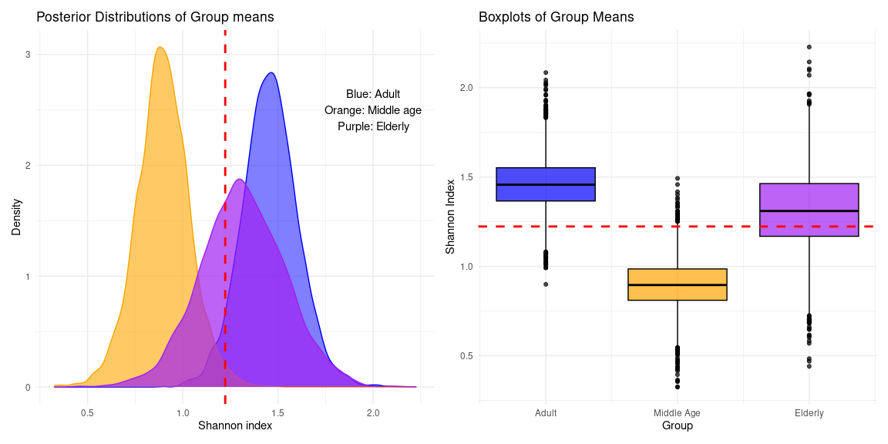

# Probabilistic workflow for univariate group comparison
Rasmus Hindström
2025-08-13

- [0. Introduction](#0-introduction)
- [1. Install and load packages](#1-install-and-load-packages)
- [2. Prepare data](#2-prepare-data)
- [3. Fitting a probabilistic model](#3-fitting-a-probabilistic-model)
  - [3.1. No pooling model](#31-no-pooling-model)
  - [3.2. Partial pooling model](#32-partial-pooling-model)
  - [3.3. Model comparison](#33-model-comparison)
- [4. Plotting and inference](#4-plotting-and-inference)
  - [4.1. Posterior plotting](#41-posterior-plotting)
  - [4.2. Probabilistic inference](#42-probabilistic-inference)

# 0. Introduction

Having established that probabilisic methods can be used as alternatives
to classical methods in univariate group comparison, we now prepare a
recommended workflow to follow.

# 1. Install and load packages

    This is bayesplot version 1.13.0

    - Online documentation and vignettes at mc-stan.org/bayesplot

    - bayesplot theme set to bayesplot::theme_default()

       * Does _not_ affect other ggplot2 plots

       * See ?bayesplot_theme_set for details on theme setting

    Loading required package: Rcpp

    Loading 'brms' package (version 2.22.0). Useful instructions
    can be found by typing help('brms'). A more detailed introduction
    to the package is available through vignette('brms_overview').


    Attaching package: 'brms'

    The following object is masked from 'package:bayesplot':

        rhat

    The following object is masked from 'package:stats':

        ar


    Attaching package: 'dplyr'

    The following objects are masked from 'package:stats':

        filter, lag

    The following objects are masked from 'package:base':

        intersect, setdiff, setequal, union

    Loading required package: MultiAssayExperiment

    Loading required package: SummarizedExperiment

    Loading required package: MatrixGenerics

    Loading required package: matrixStats


    Attaching package: 'matrixStats'

    The following object is masked from 'package:dplyr':

        count


    Attaching package: 'MatrixGenerics'

    The following objects are masked from 'package:matrixStats':

        colAlls, colAnyNAs, colAnys, colAvgsPerRowSet, colCollapse,
        colCounts, colCummaxs, colCummins, colCumprods, colCumsums,
        colDiffs, colIQRDiffs, colIQRs, colLogSumExps, colMadDiffs,
        colMads, colMaxs, colMeans2, colMedians, colMins, colOrderStats,
        colProds, colQuantiles, colRanges, colRanks, colSdDiffs, colSds,
        colSums2, colTabulates, colVarDiffs, colVars, colWeightedMads,
        colWeightedMeans, colWeightedMedians, colWeightedSds,
        colWeightedVars, rowAlls, rowAnyNAs, rowAnys, rowAvgsPerColSet,
        rowCollapse, rowCounts, rowCummaxs, rowCummins, rowCumprods,
        rowCumsums, rowDiffs, rowIQRDiffs, rowIQRs, rowLogSumExps,
        rowMadDiffs, rowMads, rowMaxs, rowMeans2, rowMedians, rowMins,
        rowOrderStats, rowProds, rowQuantiles, rowRanges, rowRanks,
        rowSdDiffs, rowSds, rowSums2, rowTabulates, rowVarDiffs, rowVars,
        rowWeightedMads, rowWeightedMeans, rowWeightedMedians,
        rowWeightedSds, rowWeightedVars

    Loading required package: GenomicRanges

    Loading required package: stats4

    Loading required package: BiocGenerics

    Loading required package: generics


    Attaching package: 'generics'

    The following object is masked from 'package:dplyr':

        explain

    The following objects are masked from 'package:base':

        as.difftime, as.factor, as.ordered, intersect, is.element, setdiff,
        setequal, union


    Attaching package: 'BiocGenerics'

    The following object is masked from 'package:dplyr':

        combine

    The following objects are masked from 'package:stats':

        IQR, mad, sd, var, xtabs

    The following objects are masked from 'package:base':

        anyDuplicated, aperm, append, as.data.frame, basename, cbind,
        colnames, dirname, do.call, duplicated, eval, evalq, Filter, Find,
        get, grep, grepl, is.unsorted, lapply, Map, mapply, match, mget,
        order, paste, pmax, pmax.int, pmin, pmin.int, Position, rank,
        rbind, Reduce, rownames, sapply, saveRDS, table, tapply, unique,
        unsplit, which.max, which.min

    Loading required package: S4Vectors


    Attaching package: 'S4Vectors'

    The following objects are masked from 'package:dplyr':

        first, rename

    The following object is masked from 'package:utils':

        findMatches

    The following objects are masked from 'package:base':

        expand.grid, I, unname

    Loading required package: IRanges


    Attaching package: 'IRanges'

    The following objects are masked from 'package:dplyr':

        collapse, desc, slice

    Loading required package: Seqinfo

    Loading required package: Biobase

    Welcome to Bioconductor

        Vignettes contain introductory material; view with
        'browseVignettes()'. To cite Bioconductor, see
        'citation("Biobase")', and for packages 'citation("pkgname")'.


    Attaching package: 'Biobase'

    The following object is masked from 'package:MatrixGenerics':

        rowMedians

    The following objects are masked from 'package:matrixStats':

        anyMissing, rowMedians

    Loading required package: SingleCellExperiment

    Loading required package: TreeSummarizedExperiment

    Loading required package: Biostrings

    Loading required package: XVector


    Attaching package: 'Biostrings'

    The following object is masked from 'package:base':

        strsplit

    This is mia version 1.17.5
    - Online documentation and vignettes: https://microbiome.github.io/mia/
    - Online book 'Orchestrating Microbiome Analysis (OMA)': https://microbiome.github.io/OMA/docs/devel/


    Attaching package: 'mia'

    The following objects are masked from 'package:dplyr':

        full_join, inner_join, left_join, right_join

# 2. Prepare data

We work under the assumption that data is in a TSE -object. For more
information on microbiome data and use of TSE -objects refer to
(Orchestrating Microbiome
Analysis)\[https://microbiome.github.io/OMA/docs/devel/index.html\]

For demonstration purposes we show the workflow with an example dataset
contained in the `mia` -package.

``` r
data("peerj13075", package = "mia")  
tse <- peerj13075 

# You may need to agglomerate your data refer to OMA
#tse <- agglomerateByRank(tse, rank = "genus")

tse <- addAlpha(
    tse,
    assay.type = "counts",
    index = "shannon"
)

# Extracting the data into a dataframe for easier modeling
df <- as.data.frame(colData(tse))

str(df)
```

    'data.frame':   58 obs. of  6 variables:
     $ Sample               : chr  "ID1" "ID2" "ID3" "ID4" ...
     $ Geographical_location: chr  "Ahmednagar" "Ahmednagar" "Ahmednagar" "Pune" ...
     $ Gender               : chr  "Male" "Female" "Male" "Male" ...
     $ Age                  : chr  "Middle_age" "Middle_age" "Adult" "Elderly" ...
     $ Diet                 : chr  "Veg" "Veg" "Veg" "Veg" ...
     $ shannon              : num  1.369 0.188 1.291 1.672 0.988 ...

# 3. Fitting a probabilistic model

## 3.1. No pooling model

Without partial pooling we still get regularization from priors. The
model is parametrized to estimate the group means directly for straight
forward comparison. This type of parametrization is also slightly more
efficient to sample.

``` r
fit1 <- brm(
    formula = bf(
        shannon ~ 0 + Age,
        sigma ~ 0 + Age
    ),
    data = df,
    family = student(),
)
```

<details class="code-fold">
<summary>Code</summary>

``` r
summary(fit1)  
```

</details>

     Family: student 
      Links: mu = identity; sigma = log; nu = identity 
    Formula: shannon ~ 0 + Age 
             sigma ~ 0 + Age
       Data: df (Number of observations: 58) 
      Draws: 4 chains, each with iter = 2000; warmup = 1000; thin = 1;
             total post-warmup draws = 4000

    Regression Coefficients:
                        Estimate Est.Error l-95% CI u-95% CI Rhat Bulk_ESS Tail_ESS
    AgeAdult                1.46      0.15     1.17     1.75 1.00     6334     2730
    AgeElderly              1.31      0.22     0.89     1.75 1.00     5382     2662
    AgeMiddle_age           0.90      0.14     0.62     1.18 1.00     5312     2515
    sigma_AgeAdult         -0.45      0.16    -0.75    -0.11 1.00     5557     2854
    sigma_AgeElderly       -0.11      0.18    -0.44     0.28 1.00     5080     2959
    sigma_AgeMiddle_age    -0.71      0.20    -1.07    -0.27 1.00     5635     2862

    Further Distributional Parameters:
       Estimate Est.Error l-95% CI u-95% CI Rhat Bulk_ESS Tail_ESS
    nu    24.24     14.54     5.65    60.60 1.00     4879     2791

    Draws were sampled using sampling(NUTS). For each parameter, Bulk_ESS
    and Tail_ESS are effective sample size measures, and Rhat is the potential
    scale reduction factor on split chains (at convergence, Rhat = 1).

## 3.2. Partial pooling model

Fitting a hierachical model with partial pooling, provides shrinkage to
correct for multiple testing more strongly. This type of model is harder
to sample, and requires some tuning to get the sampler to behave well.

``` r
fit2 <- brm(
    formula = bf(
        shannon ~ 0 + (1 | Age),
        sigma ~ 0 + (1 | Age)
    ),
    data = df,
    family = student(),
)

fit2 <- update(
    fit2,
    control = list(adapt_delta = 0.9), # Tighter acceptance
    iter = 8000 # Longer chains
)
```

<details class="code-fold">
<summary>Code</summary>

``` r
summary(fit2)
```

</details>

    Warning: There were 1 divergent transitions after warmup. Increasing
    adapt_delta above 0.9 may help. See
    http://mc-stan.org/misc/warnings.html#divergent-transitions-after-warmup

     Family: student 
      Links: mu = identity; sigma = log; nu = identity 
    Formula: shannon ~ 0 + (1 | Age) 
             sigma ~ 0 + (1 | Age)
       Data: df (Number of observations: 58) 
      Draws: 4 chains, each with iter = 8000; warmup = 4000; thin = 1;
             total post-warmup draws = 16000

    Multilevel Hyperparameters:
    ~Age (Number of levels: 3) 
                        Estimate Est.Error l-95% CI u-95% CI Rhat Bulk_ESS Tail_ESS
    sd(Intercept)           1.73      0.86     0.73     4.02 1.00     2720     3962
    sd(sigma_Intercept)     0.76      0.55     0.21     2.22 1.00     3127     6023

    Further Distributional Parameters:
       Estimate Est.Error l-95% CI u-95% CI Rhat Bulk_ESS Tail_ESS
    nu    25.61     14.72     6.64    62.58 1.00    10059     8456

    Draws were sampled using sampling(NUTS). For each parameter, Bulk_ESS
    and Tail_ESS are effective sample size measures, and Rhat is the potential
    scale reduction factor on split chains (at convergence, Rhat = 1).

<details class="code-fold">
<summary>Code</summary>

``` r
# Random effects
ranef(fit2)
```

</details>

    $Age
    , , Intercept

                Estimate Est.Error      Q2.5    Q97.5
    Adult      1.4397865 0.1473100 1.1444998 1.726264
    Elderly    1.2677900 0.2292560 0.8112987 1.717539
    Middle_age 0.8796425 0.1476717 0.5813779 1.169977

    , , sigma_Intercept

                  Estimate Est.Error       Q2.5       Q97.5
    Adult      -0.39954001 0.1652809 -0.7158165 -0.06501526
    Elderly    -0.09580482 0.1770461 -0.4269630  0.26766440
    Middle_age -0.60858026 0.2191166 -1.0017522 -0.13960889

Notice that compiling the model takes some time, but refitting the model
with `update()` is considerably faster. Switching to variational
inference can bring even larger speed benefits over MCMC, but you
sacrifice accuracy of the posterior.

## 3.3. Model comparison

We can quickly compare model performance by aproximating out-of-sample
preformance, using PSIS-LOO. This is the equivalent to LOO-CV in the
classical paradigm.

``` r
loo(fit1, fit2) 
```

    Output of model 'fit1':

    Computed from 4000 by 58 log-likelihood matrix.

             Estimate   SE
    elpd_loo    -64.0  5.0
    p_loo         5.0  0.6
    looic       128.0 10.0
    ------
    MCSE of elpd_loo is 0.0.
    MCSE and ESS estimates assume MCMC draws (r_eff in [1.0, 1.7]).

    All Pareto k estimates are good (k < 0.7).
    See help('pareto-k-diagnostic') for details.

    Output of model 'fit2':

    Computed from 16000 by 58 log-likelihood matrix.

             Estimate  SE
    elpd_loo    -64.1 4.7
    p_loo         4.6 0.6
    looic       128.2 9.3
    ------
    MCSE of elpd_loo is 0.0.
    MCSE and ESS estimates assume MCMC draws (r_eff in [0.6, 1.1]).

    All Pareto k estimates are good (k < 0.7).
    See help('pareto-k-diagnostic') for details.

    Model comparisons:
         elpd_diff se_diff
    fit1  0.0       0.0   
    fit2 -0.1       0.5   

Model performance is equivalent. `se_diff` values are larger then the
`elpd_diff`, there is no indication of either model being better then
the other on out-of-sample prediction.

I would argue that for our purpose, the no-pooling model is approriate
when there are so few groups. The regularisation from the priors is
enough, but when there are more groups compared the partial pooling
model would be favored.

# 4. Plotting and inference

We will proceed with the no-pooling model. Extracting the posterior
draws, allows easy plotting to visualize differences, compute
comparisons of interest, and make probabilistic statements or inference.

## 4.1. Posterior plotting

<details class="code-fold">
<summary>Plot code</summary>

``` r
# Get the draws
draws <- as_draws_df(fit1)
draws <- draws %>%
    select(starts_with(paste0("b_", "Age")))
pop_mean <- mean(unlist(draws))

# Density plot
p1 <- ggplot(data = draws) +
    geom_density(aes(x = b_AgeAdult), fill = "blue", alpha = 0.5, color = "blue") +
    geom_density(aes(x = b_AgeMiddle_age), fill = "orange", alpha = 0.6, color = "orange") +
    geom_density(aes(x = b_AgeElderly), fill = "purple", alpha = 0.7, color = "purple") +
    geom_vline(xintercept = pop_mean, linetype = "dashed", color = "red", linewidth = 1) +
    labs(
        title = "Posterior Distributions of Group means",
        x = "Shannon index",
        y = "Density"
    ) +
    annotate(
        "text", x = 2, y = 2.5,
        label = "Blue: Adult\nOrange: Middle age\nPurple: Elderly"
    ) +
    theme_minimal()

# Box plot
p2 <- ggplot(data = draws) +
    geom_boxplot(aes(y = b_AgeAdult, x = 1), fill = "blue", alpha = 0.7, color = "black") +
    geom_boxplot(aes(y = b_AgeMiddle_age, x = 2), fill = "orange", alpha = 0.7, color = "black") +
    geom_boxplot(aes(y = b_AgeElderly, x = 3), fill = "purple", alpha = 0.7, color = "black") +
    geom_hline(yintercept = pop_mean, linetype = "dashed", color = "red", linewidth = 1) +
    scale_x_continuous(
        breaks = c(1, 2, 3),
        labels = c("Adult", "Middle Age", "Elderly")
    ) +
    labs(
        title = "Boxplots of Group Means",
        x = "Group",
        y = "Shannon Index"
    ) +
    theme_minimal()

p1 + p2
```

</details>



## 4.2. Probabilistic inference

``` r
# Get pairwise comparisons
comparisons <- combn(names(draws), 2, simplify = FALSE)

summary_tbl <- lapply(comparisons, function(cols) {
  g1 <- cols[1]
  g2 <- cols[2]
  
  prob <- mean(draws[[g1]] > draws[[g2]])
  log2fc_vals <- log2(draws[[g1]] / draws[[g2]])
  
  tibble(
    comparison = paste(g1, "vs", g2),
    prob_g1_gt_g2 = prob,
    log2fc_mean = mean(log2fc_vals),
    log2fc_lower = quantile(log2fc_vals, 0.025),
    log2fc_upper = quantile(log2fc_vals, 0.975)
  )
}) %>% bind_rows

knitr::kable(summary_tbl, type = "pipe")
```

| comparison | prob_g1_gt_g2 | log2fc_mean | log2fc_lower | log2fc_upper |
|:---|---:|---:|---:|---:|
| b_AgeAdult vs b_AgeElderly | 0.71625 | 0.1655600 | -0.3609709 | 0.7834714 |
| b_AgeAdult vs b_AgeMiddle_age | 0.99500 | 0.7145385 | 0.2008145 | 1.3175862 |
| b_AgeElderly vs b_AgeMiddle_age | 0.94600 | 0.5489785 | -0.1342306 | 1.2207370 |
