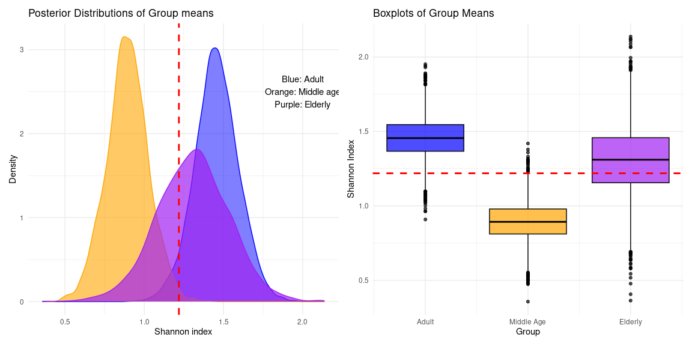

# Probabilistic workflow for univariate group comparison
Rasmus Hindström
2025-08-13

- [0. Introduction](#0-introduction)
- [1. Install and load packages](#1-install-and-load-packages)
- [2. Prepare data](#2-prepare-data)
- [3. Fitting a probabilistic model](#3-fitting-a-probabilistic-model)
  - [3.1. No pooling model](#31-no-pooling-model)
  - [3.2. Partial pooling model](#32-partial-pooling-model)
  - [3.3. Model comparison](#33-model-comparison)
- [4. Plotting and inference](#4-plotting-and-inference)
  - [4.1. Posterior plotting](#41-posterior-plotting)
  - [4.2. Probabilistic inference](#42-probabilistic-inference)

# 0. Introduction

Having established that probabilisic methods can be used as alternatives
to classical methods in univariate group comparison, we now prepare a
recommended workflow to follow.

# 1. Install and load packages

``` r
packages <- c(
    "bayesplot",
    "brms",
    "dplyr",
    "ggplot2",
)

to_install <- packages[!packages %in% installed.packages()[, "Package"]]
if (length(to_install) > 0) {
  install.packages(to_install)
}

bioc_pkg <- "mia"

if (!requireNamespace(bioc_pkg, quietly = TRUE)) {
  BiocManager::install(bioc_pkg)
}
```

``` r
library(bayesplot)
library(brms)
library(dplyr)
library(ggplot2)
library(mia)
```

# 2. Prepare data

We work under the assumption that data is in a TSE -object. For more
information on microbiome data and use of TSE -objects refer to
(Orchestrating Microbiome
Analysis)\[https://microbiome.github.io/OMA/docs/devel/index.html\]

For demonstration purposes we show the workflow with an example dataset
contained in the `mia` -package.

``` r
data("peerj13075", package = "mia")  
tse <- peerj13075 

# You may need to agglomerate your data refer to OMA
#tse <- agglomerateByRank(tse, rank = "genus")

tse <- addAlpha(
    tse,
    assay.type = "counts",
    index = "shannon"
)

# Extracting the data into a dataframe for easier modeling
df <- as.data.frame(colData(tse))

str(df)
```

    'data.frame':   58 obs. of  6 variables:
     $ Sample               : chr  "ID1" "ID2" "ID3" "ID4" ...
     $ Geographical_location: chr  "Ahmednagar" "Ahmednagar" "Ahmednagar" "Pune" ...
     $ Gender               : chr  "Male" "Female" "Male" "Male" ...
     $ Age                  : chr  "Middle_age" "Middle_age" "Adult" "Elderly" ...
     $ Diet                 : chr  "Veg" "Veg" "Veg" "Veg" ...
     $ shannon              : num  1.369 0.188 1.291 1.672 0.988 ...

# 3. Fitting a probabilistic model

## 3.1. No pooling model

Without partial pooling we still get regularization from priors. The
model is parametrized to estimate the group means directly for straight
forward comparison. This type of parametrization is also slightly more
efficient to sample.

``` r
fit1 <- brm(
    formula = bf(
        shannon ~ 0 + Age,
        sigma ~ 0 + Age
    ),
    data = df,
    family = student(),
)
```

<details class="code-fold">
<summary>Code</summary>

``` r
summary(fit1)  
```

</details>

     Family: student 
      Links: mu = identity; sigma = log; nu = identity 
    Formula: shannon ~ 0 + Age 
             sigma ~ 0 + Age
       Data: df (Number of observations: 58) 
      Draws: 4 chains, each with iter = 2000; warmup = 1000; thin = 1;
             total post-warmup draws = 4000

    Regression Coefficients:
                        Estimate Est.Error l-95% CI u-95% CI Rhat Bulk_ESS Tail_ESS
    AgeAdult                1.46      0.14     1.17     1.73 1.00     6013     3086
    AgeElderly              1.31      0.23     0.85     1.75 1.00     5983     2876
    AgeMiddle_age           0.89      0.13     0.63     1.15 1.00     5405     2488
    sigma_AgeAdult         -0.44      0.17    -0.76    -0.10 1.00     5307     2864
    sigma_AgeElderly       -0.12      0.19    -0.45     0.27 1.00     5935     3106
    sigma_AgeMiddle_age    -0.71      0.20    -1.07    -0.27 1.00     6103     2859

    Further Distributional Parameters:
       Estimate Est.Error l-95% CI u-95% CI Rhat Bulk_ESS Tail_ESS
    nu    23.95     13.85     5.76    58.67 1.00     4626     2277

    Draws were sampled using sampling(NUTS). For each parameter, Bulk_ESS
    and Tail_ESS are effective sample size measures, and Rhat is the potential
    scale reduction factor on split chains (at convergence, Rhat = 1).

## 3.2. Partial pooling model

Fitting a hierachical model with partial pooling, provides shrinkage to
correct for multiple testing more strongly. This type of model is harder
to sample, and requires some tuning to get the sampler to behave well.

``` r
fit2 <- brm(
    formula = bf(
        shannon ~ 0 + (1 | Age),
        sigma ~ 0 + (1 | Age)
    ),
    data = df,
    family = student(),
)

fit2 <- update(
    fit2,
    control = list(adapt_delta = 0.9), # Tighter acceptance
    iter = 8000 # Longer chains
)
```

<details class="code-fold">
<summary>Code</summary>

``` r
summary(fit2)
```

</details>

    Warning: There were 1 divergent transitions after warmup. Increasing
    adapt_delta above 0.9 may help. See
    http://mc-stan.org/misc/warnings.html#divergent-transitions-after-warmup

     Family: student 
      Links: mu = identity; sigma = log; nu = identity 
    Formula: shannon ~ 0 + (1 | Age) 
             sigma ~ 0 + (1 | Age)
       Data: df (Number of observations: 58) 
      Draws: 4 chains, each with iter = 8000; warmup = 4000; thin = 1;
             total post-warmup draws = 16000

    Multilevel Hyperparameters:
    ~Age (Number of levels: 3) 
                        Estimate Est.Error l-95% CI u-95% CI Rhat Bulk_ESS Tail_ESS
    sd(Intercept)           1.71      0.82     0.73     3.91 1.00     2694     4767
    sd(sigma_Intercept)     0.76      0.56     0.20     2.22 1.00     2478     4323

    Further Distributional Parameters:
       Estimate Est.Error l-95% CI u-95% CI Rhat Bulk_ESS Tail_ESS
    nu    25.52     14.45     6.73    61.60 1.00     9249     8846

    Draws were sampled using sampling(NUTS). For each parameter, Bulk_ESS
    and Tail_ESS are effective sample size measures, and Rhat is the potential
    scale reduction factor on split chains (at convergence, Rhat = 1).

<details class="code-fold">
<summary>Code</summary>

``` r
# Random effects
ranef(fit2)
```

</details>

    $Age
    , , Intercept

                Estimate Est.Error      Q2.5    Q97.5
    Adult      1.4410165 0.1467619 1.1507533 1.726123
    Elderly    1.2707304 0.2287900 0.8049843 1.718971
    Middle_age 0.8804846 0.1469261 0.5861787 1.168962

    , , sigma_Intercept

                  Estimate Est.Error       Q2.5       Q97.5
    Adult      -0.39876476 0.1679573 -0.7123822 -0.05995109
    Elderly    -0.09570628 0.1762318 -0.4235525  0.26237812
    Middle_age -0.60546891 0.2213776 -0.9999019 -0.12892360

Notice that compiling the model takes some time, but refitting the model
with `update()` is considerably faster. Switching to variational
inference can bring even larger speed benefits over MCMC, but you
sacrifice accuracy of the posterior.

## 3.3. Model comparison

We can quickly compare model performance by aproximating out-of-sample
preformance, using PSIS-LOO. This is the equivalent to LOO-CV in the
classical paradigm.

``` r
loo(fit1, fit2) 
```

    Output of model 'fit1':

    Computed from 4000 by 58 log-likelihood matrix.

             Estimate   SE
    elpd_loo    -64.0  5.0
    p_loo         5.0  0.6
    looic       127.9 10.1
    ------
    MCSE of elpd_loo is 0.0.
    MCSE and ESS estimates assume MCMC draws (r_eff in [1.1, 1.7]).

    All Pareto k estimates are good (k < 0.7).
    See help('pareto-k-diagnostic') for details.

    Output of model 'fit2':

    Computed from 16000 by 58 log-likelihood matrix.

             Estimate  SE
    elpd_loo    -64.1 4.6
    p_loo         4.5 0.6
    looic       128.2 9.3
    ------
    MCSE of elpd_loo is 0.0.
    MCSE and ESS estimates assume MCMC draws (r_eff in [0.5, 1.2]).

    All Pareto k estimates are good (k < 0.7).
    See help('pareto-k-diagnostic') for details.

    Model comparisons:
         elpd_diff se_diff
    fit1  0.0       0.0   
    fit2 -0.1       0.5   

Model performance is equivalent. `se_diff` values are larger then the
`elpd_diff`, there is no indication of either model being better then
the other on out-of-sample prediction.

I would argue that for our purpose, the no-pooling model is approriate
when there are so few groups. The regularisation from the priors is
enough, but when there are more groups compared the partial pooling
model would be favored.

# 4. Plotting and inference

We will proceed with the no-pooling model. Extracting the posterior
draws, allows easy plotting to visualize differences, compute
comparisons of interest, and make probabilistic statements or inference.

## 4.1. Posterior plotting

<details class="code-fold">
<summary>Plot code</summary>

``` r
# Get the draws
draws <- as_draws_df(fit1)
draws <- draws %>%
    select(starts_with(paste0("b_", "Age")))
pop_mean <- mean(unlist(draws))

# Density plot
p1 <- ggplot(data = draws) +
    geom_density(aes(x = b_AgeAdult), fill = "blue", alpha = 0.5, color = "blue") +
    geom_density(aes(x = b_AgeMiddle_age), fill = "orange", alpha = 0.6, color = "orange") +
    geom_density(aes(x = b_AgeElderly), fill = "purple", alpha = 0.7, color = "purple") +
    geom_vline(xintercept = pop_mean, linetype = "dashed", color = "red", linewidth = 1) +
    labs(
        title = "Posterior Distributions of Group means",
        x = "Shannon index",
        y = "Density"
    ) +
    annotate(
        "text", x = 2, y = 2.5,
        label = "Blue: Adult\nOrange: Middle age\nPurple: Elderly"
    ) +
    theme_minimal()

# Box plot
p2 <- ggplot(data = draws) +
    geom_boxplot(aes(y = b_AgeAdult, x = 1), fill = "blue", alpha = 0.7, color = "black") +
    geom_boxplot(aes(y = b_AgeMiddle_age, x = 2), fill = "orange", alpha = 0.7, color = "black") +
    geom_boxplot(aes(y = b_AgeElderly, x = 3), fill = "purple", alpha = 0.7, color = "black") +
    geom_hline(yintercept = pop_mean, linetype = "dashed", color = "red", linewidth = 1) +
    scale_x_continuous(
        breaks = c(1, 2, 3),
        labels = c("Adult", "Middle Age", "Elderly")
    ) +
    labs(
        title = "Boxplots of Group Means",
        x = "Group",
        y = "Shannon Index"
    ) +
    theme_minimal()

p1 + p2
```

</details>



## 4.2. Probabilistic inference

``` r
# Get pairwise comparisons
comparisons <- combn(names(draws), 2, simplify = FALSE)

summary_tbl <- lapply(comparisons, function(cols) {
  g1 <- cols[1]
  g2 <- cols[2]
  
  prob <- mean(draws[[g1]] > draws[[g2]])
  log2fc_vals <- log2(draws[[g1]] / draws[[g2]])
  
  tibble(
    comparison = paste(g1, "vs", g2),
    prob_g1_gt_g2 = prob,
    log2fc_mean = mean(log2fc_vals),
    log2fc_lower = quantile(log2fc_vals, 0.025),
    log2fc_upper = quantile(log2fc_vals, 0.975)
  )
}) %>% bind_rows

knitr::kable(summary_tbl, type = "pipe")
```

| comparison | prob_g1_gt_g2 | log2fc_mean | log2fc_lower | log2fc_upper |
|:---|---:|---:|---:|---:|
| b_AgeAdult vs b_AgeElderly | 0.71875 | 0.1724800 | -0.3569727 | 0.8029285 |
| b_AgeAdult vs b_AgeMiddle_age | 0.99775 | 0.7135719 | 0.2348709 | 1.2423672 |
| b_AgeElderly vs b_AgeMiddle_age | 0.94150 | 0.5410919 | -0.1679112 | 1.2321783 |
