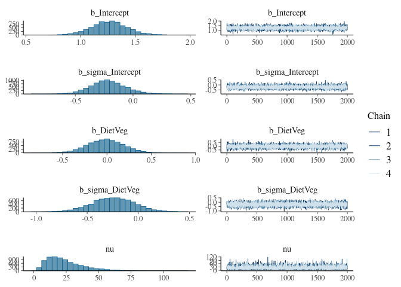
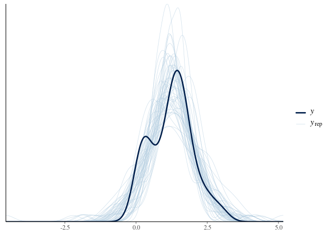

# Probabilistic alternative to 2 group t-test
Rasmus Hindström
2025-08-11

- [0. Summary](#0-summary)
- [1. Data preparation](#1-data-preparation)
- [2. Bayesian estimation](#2-bayesian-estimation)
  - [2.1. Model diagnostics](#21-model-diagnostics)
  - [2.2. Inference](#22-inference)
- [3. Welch t-test](#3-welch-t-test)
- [4. Conclusions](#4-conclusions)
- [Bibliography](#bibliography)
- [Session Info](#session-info)

# 0. Summary

This report demonstrates the use and interpretation of a probabilistic
alternative to the two sample t-test. For a more expansive deep dive
into the topic refer to Matti Vuorre’s blog post [How to Compare Two
Groups with Robust Bayesian Estimation in
R](https://vuorre.com/posts/2017-01-02-how-to-compare-two-groups-with-robust-bayesian-estimation-using-r-stan-and-brms/).
Much of which is adapted here to the context of microbiome research.

A common task in microbiome research is to compare alpha diversity
between two or more groups. Often done with the t-test and concluded as
a binary “significant or non-significant” result, the more rich
inference provided by the probabilistic comparison will become apparent.
Alpha diversity is a measure of the within sample diversity, and it is
often computed as the number of observed species (richness), the Shannon
index, or the Simpson index. Here we demostrate comparisons of the
Shannon index which takes into account abundance information, and is
typically close to normally distributed.

# 1. Data preparation

Here a dataset from the `mia` package is used to demonstrate the
comparison and interpretation differences between the two sample t-test
(Welch t-test) and an alternative probabilistic approach with Bayesian
estimation using the `brms` package.

``` r
library(mia)
library(dplyr)
library(brms)
library(bayesplot)
library(rstatix)
```

``` r
data("peerj13075", package = "mia")
tse <- peerj13075

tse <- addAlpha(
    tse,
    assay.type = "counts",
    index = "shannon"
)

df <- as.data.frame(colData(tse))
```

# 2. Bayesian estimation

As Matti Vuorre (2017) points out, the t-test is only a linear model
under the hood. Extending this idea, we can formulate a probabilistic
model and use `brms` to estimate the parameters of interest. In this
case the group means and variances. Using a Student’s t-distribution and
estimating $\nu$ allows for a more robust model that is less sensitive
to outliers.

$$y_{ik} \sim \mathcal{T}(\nu, \mu_k, \sigma_k^2)$$

$$ \mu_k = \beta_0 + \beta_k$$

$$ \sigma_k^2 = \gamma_0 + \gamma_k$$

``` r
# Fit Bayesian model (default priors)
fit <- brm(
    formula = bf(
        shannon ~ Diet,
        sigma ~ Diet
    ),
    data = df,
    family = student,
    iter = 4000,
    chains = 4,
    cores = 4
)
```

    Compiling Stan program...

    Start sampling

``` r
summary(fit)
```

     Family: student 
      Links: mu = identity; sigma = log; nu = identity 
    Formula: shannon ~ Diet 
             sigma ~ Diet
       Data: df (Number of observations: 58) 
      Draws: 4 chains, each with iter = 4000; warmup = 2000; thin = 1;
             total post-warmup draws = 8000

    Regression Coefficients:
                    Estimate Est.Error l-95% CI u-95% CI Rhat Bulk_ESS Tail_ESS
    Intercept           1.26      0.16     0.94     1.59 1.00     7916     5105
    sigma_Intercept    -0.22      0.15    -0.50     0.09 1.00     8561     5718
    DietVeg            -0.02      0.20    -0.42     0.38 1.00     8053     5756
    sigma_DietVeg      -0.25      0.21    -0.65     0.16 1.00     8865     6020

    Further Distributional Parameters:
       Estimate Est.Error l-95% CI u-95% CI Rhat Bulk_ESS Tail_ESS
    nu    23.88     14.05     5.72    58.12 1.00     7829     5025

    Draws were sampled using sampling(NUTS). For each parameter, Bulk_ESS
    and Tail_ESS are effective sample size measures, and Rhat is the potential
    scale reduction factor on split chains (at convergence, Rhat = 1).

A straight forward interpretation of the model can be made from the 95%
credible intervals (CIs). Here our baseline group is the Mixed diet. The
intercept for DietVeg shows the difference in the Shannon index compared
to the Mixed diet.

The CI for the intercept of DietVeg indicates that the difference
between the two groups is likely to not be meaningful, as the CI
includes 0.

## 2.1. Model diagnostics

``` r
plot(fit)
```



``` r
pp_check(fit, ndraws = 50)
```



The model summary shows non-pathogenic Rhat values, indicating that the
chains have converged. Effective sample sizes are sufficiently high (\>
1000) for each parameter. Chains are well mixed in the traceplots. The
posterior predictive plot shows that the model is able to capture the
observed data well enough. However, the two peaked nature of the data is
not captured.

## 2.2. Inference

Inference can directly be made from the posterior draws.

``` r
draws <- as_draws_df(fit)
post_mixed <- draws$b_Intercept
post_veg <- draws$b_Intercept + draws$b_DietVeg

# Probability of mixed > veg?
p_mixed <- mean(post_mixed > post_veg)

# Log2fc effect size?
log2fc <- log2(post_mixed / post_veg)
mean_log2fc <- mean(log2fc)
ci_log2fc <- quantile(log2fc, probs = c(0.05, 0.95))

cat("Prob(mixed > veg) = ", p_mixed)
```

    Prob(mixed > veg) =  0.53175

``` r
cat("\nMean fc: ", mean_log2fc)
```


    Mean fc:  0.01368749

``` r
cat("\nCI: ", ci_log2fc[1], " - ", ci_log2fc[2])
```


    CI:  -0.3808591  -  0.3915665

Here we see a close to 50% probability that the mixed diet group has a
higher mean shannon diversity then the vegetarian diet group. Also the
95% credible interval covers zero. Across diet, Shannon index does not
seem to differ in this data.

# 3. Welch t-test

Welch t-test frees the assumption of equal variances between the two
groups. It retains the assumption of normality.

In essence the t-test compares the means of two groups, and returns a
p-value indicating the probability of observing the data if the null
hypothesis is true. The p-value is computed as the probability of
observing a t-statistic as extreme as the one computed from the data,
under the null hypothesis. The null hypothesis states that there is no
difference between the two groups.

``` r
tt_res <- t.test(formula = shannon ~ Diet, data = df, var.equal = FALSE)
tt_res
```


        Welch Two Sample t-test

    data:  shannon by Diet
    t = 0.17328, df = 51.239, p-value = 0.8631
    alternative hypothesis: true difference in means between group Mixed and group Veg is not equal to 0
    95 percent confidence interval:
     -0.3593384  0.4272388
    sample estimates:
    mean in group Mixed   mean in group Veg 
               1.270704            1.236754 

The p-value suggests that there is no significant difference between the
two groups. Also the 95% confidence interval covers zero. We fail to
reject the null hypothesis, but cannot make probabilistic statements.

``` r
d <- cohens_d(
    data = df,
    formula = shannon ~ Diet
)

cat("Cohen's D: ", d$effsize, "\n")
```

    Cohen's D:  0.04571875 

In addition, the effect size is negligible.

# 4. Conclusions

Using a probabilisitic framework comparing means give comperable results
to the classical Welch t-test. However the inference is arguably more
straight forward, and easier to grasp. Probabilistic statements are
possible, and working with posterior draws is intuitive.

The benefit of the probabilistic approach to group comparisons will
become more clear, as we move to multi-group comparisons. The same
framework is expandable and inference is similar. Unlike with classical
tests, where careful consideration has to be made choice of test,
post-hoc corrections, and their assumptions and interpretation.

# Bibliography

- Vuorre, Matti. 2017. “How to Compare Two Groups with Robust Bayesian
  Estimation in R.” January 2, 2017.
  <https://vuorre.com/posts/2017-01-02-how-to-compare-two-groups-with-robust-bayesian-estimation-using-r-stan-and-brms/>.

# Session Info

``` r
sessionInfo()
```

    R version 4.5.1 (2025-06-13)
    Platform: x86_64-pc-linux-gnu
    Running under: Pop!_OS 22.04 LTS

    Matrix products: default
    BLAS:   /usr/lib/x86_64-linux-gnu/blas/libblas.so.3.10.0 
    LAPACK: /usr/lib/x86_64-linux-gnu/lapack/liblapack.so.3.10.0  LAPACK version 3.10.0

    locale:
     [1] LC_CTYPE=en_US.UTF-8       LC_NUMERIC=C              
     [3] LC_TIME=en_DK.UTF-8        LC_COLLATE=en_US.UTF-8    
     [5] LC_MONETARY=en_DK.UTF-8    LC_MESSAGES=en_US.UTF-8   
     [7] LC_PAPER=en_DK.UTF-8       LC_NAME=C                 
     [9] LC_ADDRESS=C               LC_TELEPHONE=C            
    [11] LC_MEASUREMENT=en_DK.UTF-8 LC_IDENTIFICATION=C       

    time zone: Europe/Helsinki
    tzcode source: system (glibc)

    attached base packages:
    [1] stats4    stats     graphics  grDevices utils     datasets  methods  
    [8] base     

    other attached packages:
     [1] rstatix_0.7.2                   bayesplot_1.13.0               
     [3] brms_2.22.0                     Rcpp_1.1.0                     
     [5] dplyr_1.1.4                     mia_1.17.5                     
     [7] TreeSummarizedExperiment_2.17.1 Biostrings_2.77.2              
     [9] XVector_0.49.0                  SingleCellExperiment_1.31.1    
    [11] MultiAssayExperiment_1.35.6     SummarizedExperiment_1.39.1    
    [13] Biobase_2.69.0                  GenomicRanges_1.61.1           
    [15] Seqinfo_0.99.2                  IRanges_2.43.0                 
    [17] S4Vectors_0.47.0                BiocGenerics_0.55.1            
    [19] generics_0.1.4                  MatrixGenerics_1.21.0          
    [21] matrixStats_1.5.0              

    loaded via a namespace (and not attached):
      [1] RColorBrewer_1.1-3          tensorA_0.36.2.1           
      [3] jsonlite_2.0.0              magrittr_2.0.3             
      [5] TH.data_1.1-3               estimability_1.5.1         
      [7] ggbeeswarm_0.7.2            farver_2.1.2               
      [9] rmarkdown_2.29              fs_1.6.6                   
     [11] ragg_1.4.0                  vctrs_0.6.5                
     [13] DelayedMatrixStats_1.31.0   htmltools_0.5.8.1          
     [15] S4Arrays_1.9.1              BiocBaseUtils_1.11.2       
     [17] curl_6.4.0                  distributional_0.5.0       
     [19] broom_1.0.9                 BiocNeighbors_2.3.1        
     [21] cellranger_1.1.0            Formula_1.2-5              
     [23] SparseArray_1.9.1           StanHeaders_2.32.10        
     [25] parallelly_1.45.1           plyr_1.8.9                 
     [27] DECIPHER_3.5.0              sandwich_3.1-1             
     [29] emmeans_1.11.2              zoo_1.8-14                 
     [31] igraph_2.1.4                lifecycle_1.0.4            
     [33] pkgconfig_2.0.3             rsvd_1.0.5                 
     [35] Matrix_1.7-3                R6_2.6.1                   
     [37] fastmap_1.2.0               digest_0.6.37              
     [39] ggnewscale_0.5.2            ps_1.9.1                   
     [41] patchwork_1.3.1             scater_1.37.0              
     [43] irlba_2.3.5.1               textshaping_1.0.1          
     [45] vegan_2.7-1                 beachmat_2.25.3            
     [47] labeling_0.4.3              abind_1.4-8                
     [49] mgcv_1.9-3                  compiler_4.5.1             
     [51] withr_3.0.2                 inline_0.3.21              
     [53] backports_1.5.0             BiocParallel_1.43.4        
     [55] carData_3.0-5               viridis_0.6.5              
     [57] DBI_1.2.3                   QuickJSR_1.8.0             
     [59] pkgbuild_1.4.8              MASS_7.3-65                
     [61] DelayedArray_0.35.2         bluster_1.19.0             
     [63] loo_2.8.0                   permute_0.9-8              
     [65] tools_4.5.1                 vipor_0.4.7                
     [67] beeswarm_0.4.0              ape_5.8-1                  
     [69] glue_1.8.0                  callr_3.7.6                
     [71] nlme_3.1-168                gridtext_0.1.5             
     [73] grid_4.5.1                  checkmate_2.3.2            
     [75] cluster_2.1.8.1             reshape2_1.4.4             
     [77] gtable_0.3.6                fillpattern_1.0.2          
     [79] tzdb_0.5.0                  tidyr_1.3.1                
     [81] hms_1.1.3                   car_3.1-3                  
     [83] BiocSingular_1.25.0         ScaledMatrix_1.17.0        
     [85] xml2_1.3.8                  ggrepel_0.9.6              
     [87] pillar_1.11.0               stringr_1.5.1              
     [89] yulab.utils_0.2.0           posterior_1.6.1            
     [91] splines_4.5.1               ggtext_0.1.2               
     [93] treeio_1.33.0               lattice_0.22-7             
     [95] survival_3.8-3              tidyselect_1.2.1           
     [97] DirichletMultinomial_1.51.0 scuttle_1.19.0             
     [99] knitr_1.50                  gridExtra_2.3              
    [101] V8_6.0.4                    xfun_0.52                  
    [103] bridgesampling_1.1-2        rstan_2.32.7               
    [105] rbiom_2.2.1                 stringi_1.8.7              
    [107] lazyeval_0.2.2              yaml_2.3.10                
    [109] evaluate_1.0.4              codetools_0.2-20           
    [111] tibble_3.3.0                cli_3.6.5                  
    [113] RcppParallel_5.1.10         xtable_1.8-4               
    [115] systemfonts_1.2.3           processx_3.8.6             
    [117] readxl_1.4.5                coda_0.19-4.1              
    [119] parallel_4.5.1              rstantools_2.4.0           
    [121] ggplot2_3.5.2               readr_2.1.5                
    [123] Brobdingnag_1.2-9           sparseMatrixStats_1.21.0   
    [125] decontam_1.29.0             viridisLite_0.4.2          
    [127] mvtnorm_1.3-3               slam_0.1-55                
    [129] tidytree_0.4.6              scales_1.4.0               
    [131] purrr_1.1.0                 crayon_1.5.3               
    [133] rlang_1.1.6                 multcomp_1.4-28            
